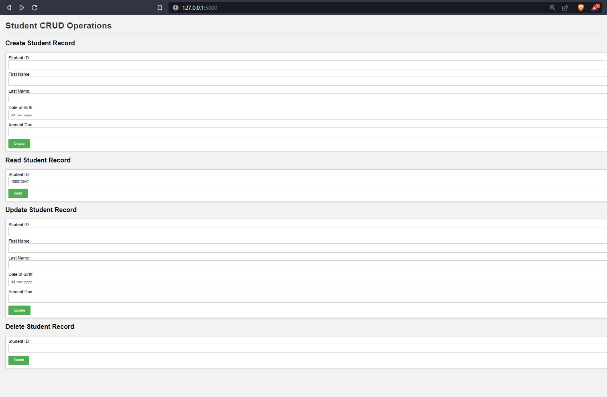

# Student CRUD Operations with Flask and SQLite

This is a simple web application built with Flask, a lightweight Python web framework, and SQLite as the database to perform CRUD (Create, Read, Update, Delete) operations on student records. The application allows users to create, read, update, and delete student information through a user-friendly web interface.

## Table of Contents

- [Getting Started](#getting-started)
  - [Prerequisites](#prerequisites)
  - [Installation](#installation)
- [Usage](#usage)
- [Endpoints](#endpoints)
- [Database Schema](#database-schema)
- [Contributing](#contributing)
- [License](#license)

## Getting Started

### Prerequisites

Before running the application, ensure you have the following installed:

- Python (>=3.6)
- Flask (>=1.1.2)
- SQLite (or any other supported database)

### Installation

1. Clone the repository:

```
git clone https://github.com/your-username/student-crud-flask.git
```
#### Change directory
```
cd student-crud-flask
```

2. Install the required dependencies:

```
pip install requirement.txt
```

## Usage

1. Run the Flask application:

```
python app.py
```


2. Access the application in your web browser at `http://localhost:5000/`.

3. Use the provided HTML forms to perform CRUD operations on student records.

## Endpoints

- `POST /students`: Create a new student record.
- `GET /students?read_id=<student_id>`: Read a specific student record.
- `POST /students/update`: Update an existing student record.
- `POST /students/delete`: Delete a student record.
- `GET /students`: Retrieve all student records.

## Database Schema

The application uses a SQLite database to store student records. The `student` table schema is as follows:

- `student_id` (INTEGER): Primary key, auto-incremented unique identifier for each student.
- `first_name` (TEXT): First name of the student.
- `last_name` (TEXT): Last name of the student.
- `dob` (TEXT): Date of Birth of the student.
- `amount_due` (REAL): Amount due or outstanding balance for the student.

## Contributing

Contributions are welcome! If you find any issues or want to add new features, please feel free to open an issue or submit a pull request.
## Preview

